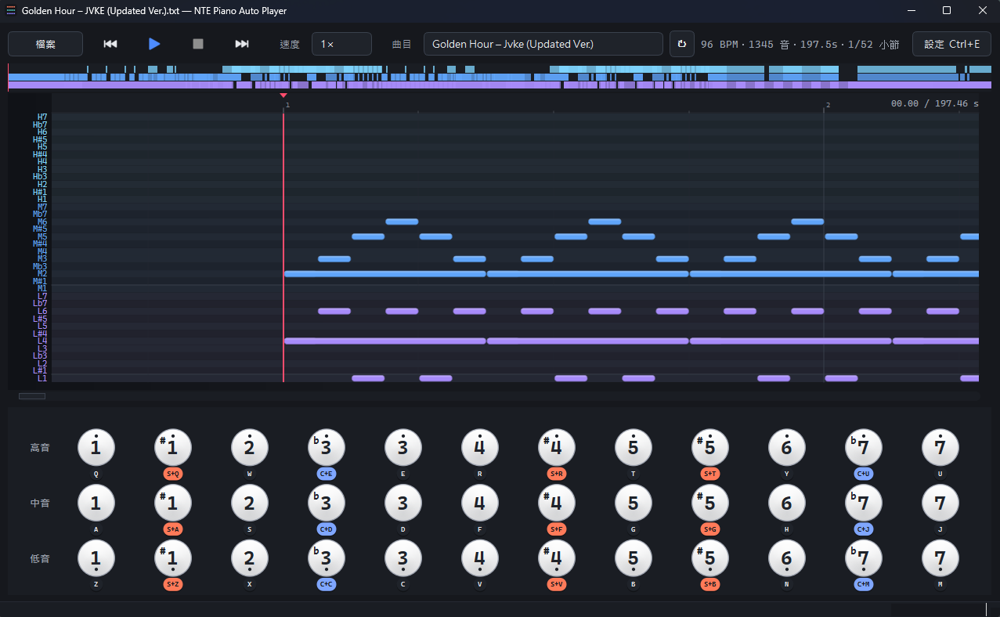

# NTE Piano

> **NTE 遊戲鋼琴介面，目前唯一具備高精度可視化編輯與自動演奏的桌面工具。**

NTE 內建鋼琴介面有 36 個按鍵、三排八度，但遊戲本身沒有提供完整的譜面編輯或自動演奏功能。網路上能找到的工具多半只是「按文字檔順序送鍵」，沒有 Piano Roll 預覽、沒有圖形化編輯、也接不了真實樂譜檔。

NTE Piano 把這塊空缺補上：支援匯入 MusicXML / MIDI / MuseScore 檔，自動轉成遊戲鍵位、用 Piano Roll 卷簾預覽、按下 F6 就把按鍵送進遊戲視窗。



> **小聲說明**：作者的程式設計經驗還在累積中，本專案有相當比例的程式碼是與 AI 協同撰寫的，難免有不夠優雅或不夠嚴謹之處。看到任何問題、想法、改進建議，都非常歡迎透過 issue / PR 回報，會很感激 QQ

---

## 為什麼選 NTE Piano

- **市面唯一的高精度 GUI 編輯**。其他工具多半只給你一個文字框，本工具提供完整的 Piano Roll 卷簾預覽 + 仿遊戲 36 鍵鋼琴介面 + 縮略圖總覽，三者播放時同步。
- **看得到的時間軸**。播放遊標固定、譜面從右往左流動，提早 4.5 秒看到即將到來的音符，按錯就知道是譜面還是時序問題。
- **多檔案匯入支援**。MusicXML、MIDI、MuseScore 三種主流格式拖進來就用，自動移調、自動分上下手、自動把超出三排八度的音符摺回可彈範圍。
- **時序精準**。播放排程以高精度計時器為基準，按下與抬起的間距可以細調（`hold` 與 `gap` 兩個全域命令），長音、短音、和弦、變速都能對上節拍。
- **遊戲不用切到前景**。F6 / F7 全域熱鍵，背景跑著也能控制播放。失焦時還能自動把遊戲音量靜音。
- **附帶的遊戲內小工具**。聲音閃避反擊、自動音遊互動（實驗性），跟鋼琴一起放在同一個介面。

---

## 安裝

### 一般使用者

到 [Releases](../../releases) 頁面下載最新版的 `NTEPiano-Setup.exe`，雙擊安裝即可，**不需要裝 Python**。

### 從原始碼執行（開發者）

需要 Windows 10 / 11 與 Python 3.14（從 [python.org](https://www.python.org/downloads/) 取得）。

```cmd
py -3.14 -m pip install -r requirements.txt
py -3.14 piano_player.py
```

### 額外需要的軟體

- **MuseScore 4**（[免費下載](https://musescore.org/zh-hant/download)） — 只有匯入 `.mscz` / `.mscx` 時需要。NTE Piano 會自動找系統內的 `MuseScore4.exe`，請使用 **MuseScore 4 以上版本**，舊版（MuseScore 3 或更早）的 CLI 介面不一致。
  - 不匯入 MuseScore 檔的話可以跳過。
  - 已內嵌 `.mxl` 的 `.mscz` 不需要 MuseScore 也能讀。

---

## 第一次使用

1. 啟動 NTE Piano，會看到上方工具列、中間 Piano Roll 預覽區、下方仿遊戲鋼琴鍵盤。
2. 點工具列「檔案 → 匯入」，挑你的 MIDI / MusicXML / MuseScore 檔。
3. Piano Roll 會跑出音符方塊，工具列中央顯示 BPM、音數、總長。如果想微調，按 **Ctrl+E** 打開右側譜面編輯抽屜手動調整。
4. 切到 NTE 遊戲視窗、進入鋼琴介面，按下 **F6**。NTE Piano 會自動找遊戲視窗並把焦點切過去，然後開始演奏。
5. 想停就按 **F7**。

> 部分遊戲只接受由管理員身份送出的按鍵事件，按 F6 沒反應的話請用 **`run.bat`** 啟動（會自動 UAC 提權）。

---

## 操作快捷鍵

| 鍵 | 動作 |
|---|---|
| **F6** | 開始播放（全域，不需切回 NTE Piano 視窗） |
| **F7** | 停止播放（全域） |
| **Ctrl+E** | 切換右側譜面編輯抽屜 |
| **Esc** | 關閉編輯抽屜 |
| **Ctrl+N** / **Ctrl+O** | 新增 / 開啟譜面 |
| **Ctrl+S** / **Ctrl+Shift+S** | 儲存 / 另存譜面 |
| **Ctrl+I** | 匯入 MusicXML |
| **Ctrl+Z** / **Ctrl+Y** | 撤銷 / 重做 |

「檔案」選單還有更多匯入選項與可勾選的設定，例如：動畫效果開關、未存檔提醒、失焦自動暫停、匯入時一併匯入變速、音符配色風格切換等。

---

## 支援的譜面格式

| 格式 | 副檔名 | 需要額外軟體 |
|---|---|---|
| 內建 DSL（文字檔） | `.txt` | 無 |
| MusicXML | `.xml` / `.mxl` | 無 |
| MIDI | `.mid` / `.midi` | 無 |
| MuseScore | `.mscz` / `.mscx` | **MuseScore 4 或以上** |

匯入時會自動：

- 把音域摺到 H（高音）/ M（中音）/ L（低音）三排八度內
- 右手偏高、左手偏低
- 自動推算移調（MIDI 由 KeySignature、MusicXML 由五度圈推算）
- 合併同時刻的重疊音為和弦

---

## 譜面 DSL 速覽

NTE Piano 用自定義的簡譜風格 DSL 描述譜面，編輯抽屜內看到的就是這個格式。新手不用懂，直接匯入即可；想手動微調再來看這段。

| 元素 | 寫法 | 範例 |
|---|---|---|
| 八度 | `H` 高 / `M` 中 / `L` 低 | `M1` = 中音 Do |
| 升降 | `#`（Shift） / `b`（Ctrl） | `M#1`、`Lb7` |
| 時值倍率 | `*N` | `M1*2`（兩拍） |
| 和弦 | `[X+Y+Z]` | `[M1+M3+M5]*2` |
| 休止 | `0` / `-` / `.` / `R` / `REST` | `M1 - M2` |
| 多軌 | `track right` / `track left` | 各自獨立時間 |
| 變速 | `tempo @ N = BPM` | `tempo @ 16 = 90` |
| 註解 | `#` 開頭整行 | `# 副歌` |

最小範例：

```text
tempo 120
beat 0.5
track right
M1 M2 M3 M3 M3 M3 -
M2 M2 M3 M2 M1 - -
track left
[L1+L5]*2 [L4+L1]*2 [L5+L2]*2
```

全域命令還有 `gap`（按鍵間最小間距）、`hold`（按下持續比例）、`modifier_delay`（修飾鍵延遲），可以對遊戲端的反應速度微調。

---

## 命令列批次匯入

如果想一次轉一堆譜，`tools/` 內有兩支 CLI 腳本：

```cmd
:: MusicXML → DSL
py -3.14 tools\mxl_to_dsl.py "input.mxl" "output.txt"

:: MIDI → DSL（由 KeySignature 自動移調）
py -3.14 tools\midi_to_dsl.py "input.mid" "output.txt" --auto-transpose
```

兩支腳本支援 `--right-prefer` / `--left-prefer` / `--melody-mode` 等參數，行為與 GUI 內「匯入」完全一致。MuseScore 沒有獨立 CLI，請從 GUI 匯入。

---

## 譜面庫

NTE Piano 啟動時會從 `songs/` 內隨機挑一首載入。主人可以把自己整理好的 `.txt` 直接丟進這個資料夾，重啟後會出現在工具列下拉選單。

本專案不附帶任何商業作品的譜面（版權考量），請自行匯入自己的樂譜檔。

---

## 額外功能

NTE Piano 不只演奏，還順手把幾個遊戲內的小自動化整合進來：

- **聲音閃避反擊**（實驗性）：偵測遊戲音效，自動在閃避視窗內按反擊鍵。
- **自動音遊**（實驗性）：辨識畫面節奏條，自動點擊。
- **失焦自動靜音**：切走遊戲視窗時，自動把 NTE 的音量降到 0，回來時還原。
- **粉爪大劫案**：修復了每次拾取物品有種卡頓感覺，只需按住設定按鍵即可快速拾取。

這些功能可從設定面板開關，不用時不會佔資源。標註「實驗性」的項目目前還在打磨，可用但偶爾會出包。

---

## 授權

GPL-3.0-or-later。詳見 `LICENSE`。

Copyright (C) 2026 Yulun。
